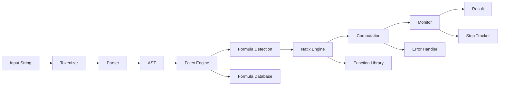
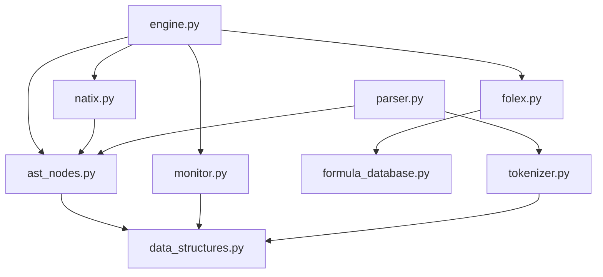

# 🏗️ FLN Math Engine - Project Structure

## 📁 **Directory Overview**

```
fln-math-engine/
├── 📁 FLN/                          # Core engine modules
│   ├── 🐍 __init__.py              # Package initialization
│   ├── 🧮 ast_nodes.py             # Abstract Syntax Tree nodes
│   ├── 🔧 engine.py                # Main MathEngine class
│   ├── 🔍 folex.py                 # Formula detection engine
│   ├── 📚 formula_database.py      # 224+ mathematical formulas
│   ├── 📊 monitor.py               # Computation monitoring
│   ├── ⚡ natix.py                 # Numerical evaluation engine
│   ├── 🔌 parser.py                # Mathematical expression parser
│   ├── 🗃️ tokenizer.py             # Token generation
│   └── 📊 data_structures.py       # Core data structures
├── 📁 docs/                         # Documentation
│   ├── 📖 README.md                # Main project documentation
│   ├── 🏗️ PROJECT_STRUCTURE.md     # This file
│   └── 📋 CHANGELOG.md             # Version history
├── 📁 examples/                     # Usage examples
│   ├── 🚀 quick_start.py           # Quick start guide
│   ├── 📚 example.py               # Comprehensive examples
│   └── 🧪 test_improvements.py     # Test suite
├── 📁 tests/                        # Test files
│   └── 🧪 test_engine.py           # Engine tests
├── 📄 LICENSE                       # MIT License
├── 📋 requirements.txt              # Minimal dependencies
├── 🔧 requirements-dev.txt          # Development dependencies
└── 📖 README.md                     # GitHub README
```

## 🧩 **Core Module Architecture**

### **1. FLN Package (`FLN/`)**
The heart of the mathematical computation engine.

#### **`__init__.py`**
- Package initialization
- Version information
- Main exports

#### **`ast_nodes.py`**
- **ASTNode**: Base class for all mathematical expressions
- **NumberNode**: Represents numeric values
- **VariableNode**: Represents variables
- **OperatorNode**: Represents binary operations
- **FunctionNode**: Represents function calls
- **ParenthesesNode**: Represents grouped expressions
- **UnaryNode**: Represents unary operations
- **DerivativeNode**: Represents derivatives
- **IntegralNode**: Represents integrals

#### **`engine.py`**
- **MathEngine**: Main engine class
- Configuration management
- Caching system
- Formula integration
- Error handling

#### **`folex.py`**
- **Folex**: Formula detection engine
- Pattern matching
- Formula recognition
- Confidence scoring
- Pattern conversion

#### **`formula_database.py`**
- **FormulaDatabase**: 224+ mathematical formulas
- **FormulaDefinition**: Individual formula structure
- Categorized by grade and topic
- Regex pattern matching
- Educational descriptions

#### **`monitor.py`**
- **ComputationMonitor**: Step-by-step tracking
- **EvaluationResult**: Computation results
- **ComputationStep**: Individual computation steps
- Accuracy monitoring
- Performance tracking

#### **`natix.py`**
- **Natix**: Numerical evaluation engine
- **EvaluationContext**: Evaluation state management
- Node evaluation
- Error handling
- Caching integration

#### **`parser.py`**
- **Parser**: Mathematical expression parser
- Recursive descent parsing
- Operator precedence
- Expression building
- AST construction

#### **`tokenizer.py`**
- **Tokenizer**: Token generation
- **Token**: Individual token structure
- **TokenType**: Token classification
- Pattern matching
- Input validation

#### **`data_structures.py`**
- **EvaluationType**: Evaluation classification
- **FormulaMatch**: Formula detection results
- **ComputationStep**: Step tracking
- **EvaluationResult**: Final results
- **ParsingContext**: Parsing state

## 🔄 **Data Flow Architecture**



## 🎯 **Key Design Principles**

### **1. Modularity**
- Each module has a single responsibility
- Clear interfaces between components
- Easy to extend and modify

### **2. Performance**
- Intelligent caching system
- Optimized data structures
- Minimal memory footprint

### **3. Extensibility**
- Easy to add new functions
- Simple to extend formula database
- Modular architecture

### **4. AI Ready**
- Step-by-step computation tracking
- Formula pattern recognition
- Extensible computation context

## 🔧 **Development Workflow**

### **1. Adding New Functions**
1. Add new node type to `ast_nodes.py`
2. Implement evaluation logic in `natix.py`
3. Add parsing support in `parser.py`
4. Update tokenizer if needed
5. Add tests and documentation

### **2. Adding New Formulas**
1. Add formula definition to `formula_database.py`
2. Test pattern matching
3. Verify detection accuracy
4. Update documentation

### **3. Performance Optimization**
1. Profile performance bottlenecks
2. Optimize data structures
3. Improve caching strategies
4. Benchmark improvements

## 📊 **Module Dependencies**



## 🚀 **Future Architecture Plans**

### **Phase 2: Advanced Features**
- **Web Interface**: Flask/FastAPI backend
- **Mobile Apps**: React Native applications
- **Cloud Service**: AWS/Azure deployment
- **API Gateway**: RESTful API service

### **Phase 3: AI Integration**
- **Machine Learning**: TensorFlow/PyTorch integration
- **Natural Language**: Math expression parsing
- **Computer Vision**: Handwritten math recognition
- **Collaborative AI**: Multi-AI systems

### **Phase 4: Enterprise Features**
- **Multi-tenancy**: User management system
- **Analytics**: Usage tracking and insights
- **Security**: Authentication and authorization
- **Scalability**: Load balancing and clustering

## 📋 **Development Guidelines**

### **Code Standards**
- **PEP 8**: Python style guidelines
- **Type Hints**: Full type annotation
- **Docstrings**: Comprehensive documentation
- **Testing**: 90%+ code coverage

### **Performance Targets**
- **Basic Operations**: < 1ms
- **Complex Expressions**: < 10ms
- **Formula Detection**: < 5ms
- **Memory Usage**: < 10MB

### **Quality Metrics**
- **Test Coverage**: > 90%
- **Documentation**: 100% documented
- **Performance**: Meets benchmarks
- **Error Handling**: Comprehensive coverage

---

## 🌟 **Architecture Highlights**

### **Self-Created Innovation**
- **Original Design**: Built from scratch, not based on existing libraries
- **Unique Architecture**: Novel approach to mathematical computation
- **AI Collaboration**: Demonstrates human-AI development partnership

### **Technical Excellence**
- **Pure Python**: No external dependencies
- **Lightweight**: Minimal resource requirements
- **Fast**: Optimized for real-time applications
- **Extensible**: Easy to add new capabilities

### **Future Ready**
- **AI Integration**: Built for machine learning era
- **Cloud Native**: Designed for scalable deployment
- **Educational Focus**: Perfect for learning applications
- **Open Source**: Community-driven development

---

**🏗️ This architecture represents a new paradigm in mathematical computation engines, combining innovation, performance, and AI readiness in a lightweight, extensible package.**
